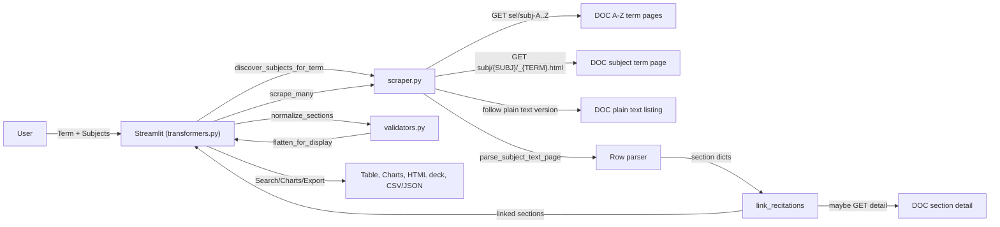

# Lab2DataIsGold

## Project Structure

```
project-name/
├── src/
│   ├── scraper.py          # Main scraping logic
│   ├── validators.py       # Data validation rules
│   ├── transformers.py     # Data transformation pipeline
├── docs/
│   ├── BUSINESS_CASE.md    # Market analysis and pricing
│   ├── ETHICS.md           # Detailed ethical analysis
│   ├── ARCHITECTURE.md     # Technical design decisions
│   ├── AI_USAGE.md         # AI collaboration documentation
├── data/
│   └── sample_output.json  # Example of processed data
├── requirements.txt
├── README.md
└── .gitignore
```

# Columbia Course Finder (Demo)

> **🎯 SUBMISSION INFO - PLEASE GRADE THIS BRANCH 🎯**  
> **Graded branch**: `submission-files` ⭐ **THIS IS THE BRANCH TO GRADE** ⭐  
> **Submission date**: September 16, 2025  
> **Final submission commit**: Latest commit on `submission-files` branch  

> ⚠️ **IMPORTANT FOR GRADERS**: This `submission-files` branch contains the final, complete submission. Please use this branch for grading, not `main` or any other branch.

> This repository structure matches all assignment requirements. All documentation, source code, and deliverables are included and ready for evaluation.

## **Executive Summary**

**Problem & Motivation**  
Columbia students currently struggle with course selection because the university’s tools (Vergil, Directory of Classes) are outdated, difficult to filter, and fragmented. Students spend hours comparing options manually, while advisors lack streamlined tools to guide them.

**Our Solution**  
We provide a **clean, structured dataset** of all Columbia courses, scraped and continuously updated. Students can search by instructor, prerequisites, times, seat availability, and more. Advisors and student orgs can use the dataset for planning. Columbia itself could license the dataset, avoiding costly in-house development while improving student satisfaction and enrollment efficiency.

**Why Now**

* Columbia’s existing Open Data API is locked behind login and redistribution restrictions.  
* No public-facing tool exists that is both **comprehensive** and **student-friendly**.  
* Our scraper makes this possible at low cost and minimal impact on Columbia’s systems.

**Who Benefits**

* **Students** → faster, smarter course discovery.  
* **Advisors & Orgs** → better planning and guidance tools.  
* **Columbia** → opportunity to license data to boost digital infrastructure and retention.

## Architecture Diagram


## Quick Start

### Install dependencies
```bash
pip install -r requirements.txt
```

### Launch streamlit UI dashboard (for interactive data viewing)
```bash
streamlit run src/transformers.py
```

### Scrape and output to file (for data analysis through JSON file)
```bash
python -m src/scraper --scrape --term "Fall 2025" --subjects COMS STAT APMA -o data/sample_output.json
```
